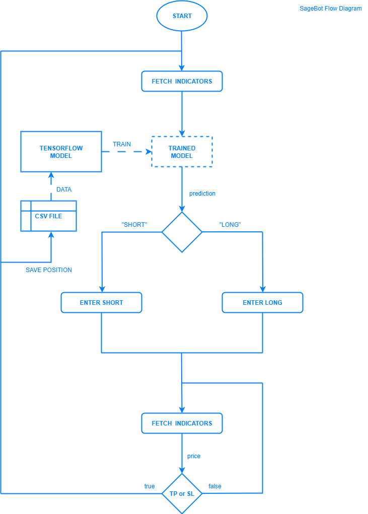

<div align="center">
  
</div>

[](https://www.python.org/downloads/)
[](#)
[](https://github.com/yy-trading-bots/sage-bot/actions/workflows/ci.yml)
[](https://github.com/yy-trading-bots/sage-bot/blob/master/LICENSE)

# SageBot

> An AI cryptocurrency trading bot for Binance that uses past positions to train a new model at each iteration.

---

## 📖 Description

SageBot is a Python trading bot that applies technical indicators to train an AI-driven model capable of performing advanced deep learning analysis. The model is continually retrained on cumulative market data, allowing it to deliver increasingly accurate predictions over time and enabling smarter trading decisions. The project also serves as a concise reference implementation for developers building their own trading bots.

---

## 🎯 Strategy

> “Sages are not those who never make mistakes, but those who learn from them.”

SageBot is designed around the principle of iterative learning, where each trading cycle contributes to the refinement of the predictive model. At every new trade iteration, the model is retrained with cumulative market data, ensuring that each successive version incorporates more historical and contextual information than the last. This allows the system to dynamically adapt to market conditions while steadily improving the accuracy of its predictions. Instead of relying on a fixed strategy, the bot evolves over time, embodying a process of continuous self-improvement.

The feature set of the bot is grounded in widely recognized technical indicators, each providing unique insights into market behavior:

- **Trend filter (EMA)** – Evaluates the price relative to the 100-period Exponential Moving Average (`EMA_100`) to determine whether the market bias is bullish or bearish.
- **Momentum (MACD)** – Uses the relationship between the MACD line, the signal line, and the zero line to assess both the direction and strength of the trend.
- **Momentum (RSI)** – Applies a short-period RSI threshold around the 50 level to confirm the momentum direction and filter out false signals.

> To encourage flexibility, the model implementation in `src/tensorflow_model/tf_model` has not been provided on purpose. This gives developers the freedom to build and customize their own model according to specific trading goals and risk preferences. The system architecture and flow diagram act as a framework, while the predictive core remains open for personal experimentation and optimization.

The flow diagram of the bot is as follows:

<div align="center">
   
</div>

---

## ⚙️ Configuration

First, rename `settings.example.toml` to **`settings.toml`** and edit the fields to match your preferences.

| Key              | Section      |    Type |     Default | Description                                                                                   | Example              |
| ---------------- | ------------ | ------: | ----------: | --------------------------------------------------------------------------------------------- | -------------------- |
| `PUBLIC_KEY`     | `[API]`      |  string |        `""` | Your Binance API key. Grant only the permissions you actually need. **Do not commit to VCS.** | `"AKIA..."`          |
| `SECRET_KEY`     | `[API]`      |  string |        `""` | Your Binance API secret. Keep it secret and out of the repo.                                  | `"wJalrXUtnFEMI..."` |
| `SYMBOL`         | `[POSITION]` |  string | `"ETHUSDT"` | Trading symbol (e.g., USDT-M futures or spot pair).                                           | `"BTCUSDT"`          |
| `COIN_PRECISION` | `[POSITION]` | integer |         `2` | Quantity precision for orders. Must align with the exchange **lot size** rules.               | `3`                  |
| `TP_RATIO`       | `[POSITION]` |   float |    `0.0050` | Take-profit distance **relative to entry**. `0.0050` = **0.5%**.                              | `0.0100`             |
| `SL_RATIO`       | `[POSITION]` |   float |    `0.0050` | Stop-loss distance **relative to entry**. `0.0050` = **0.5%**.                                | `0.0075`             |
| `LEVERAGE`       | `[POSITION]` | integer |         `1` | Leverage to apply (for futures). Use responsibly.                                             | `5`                  |
| `TEST_MODE`      | `[RUNTIME]`  |    bool |      `true` | Paper/Test mode. When `true`, no live orders are sent (or a testnet is used).                 | `false`              |
| `DEBUG_MODE`     | `[RUNTIME]`  |    bool |     `false` | Verbose logging and extra assertions.                                                         | `true`               |
| `INTERVAL`       | `[RUNTIME]`  |  string |     `"15m"` | Indicator/candle interval (e.g., `1m`, `5m`, `15m`, `1h`, ...).                               | `"1h"`               |
| `SLEEP_DURATION` | `[RUNTIME]`  |   float |      `30.0` | Delay (seconds) between loops to respect API limits.                                          | `10.0`               |

**Where to get API keys:** Binance → **API Management**: [https://www.binance.com/en/my/settings/api-management](https://www.binance.com/en/my/settings/api-management)

> Tips
>
> - Keep `COIN_PRECISION` in sync with `exchangeInfo` (lot/tick size) to avoid rejected orders.

---

## ▶️ How to Run

> Ensure `settings.toml` is properly configured **before** running.

There are two ways to run the bot, and you may choose whichever best suits your needs.

### 1) Docker

```bash
# Build the image
docker build -t sagebot .

# Run (Linux/macOS)
docker run --rm \
  -v "$(pwd)/src:/app/src" \
  sagebot

# Run (Windows CMD)
docker run --rm \
  -v "%cd%\src:/app/src"
  sagebot
```

> The volumes mount your local `src/` for output log files.

### 2) Python (virtualenv)

```bash
# Create a virtual environment
python -m venv .venv

# Activate
# Linux/macOS
source ./.venv/bin/activate
# Windows CMD
.\.venv\Scripts\activate

# Install dependencies
pip install -r requirements.txt

# Run
python src/main.py   # direct module/script
```

---

## ⚠️ Warnings

> **Disclaimer:** Trading cryptocurrencies — especially with **leverage** — involves **significant risk**. This bot is **not financial advice** and is provided for educational/experimental purposes only. Review the code and the strategy thoroughly, start small, and only trade with funds you can afford to lose. **All P\&L is your responsibility.**
>
> Protect your API keys, never commit secrets, and be aware of operational risks such as rate limits, network issues, exchange maintenance, and **slippage**, all of which can materially affect performance.

.
